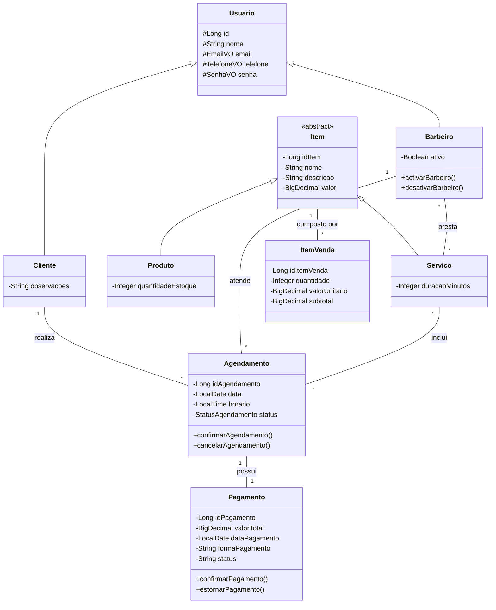
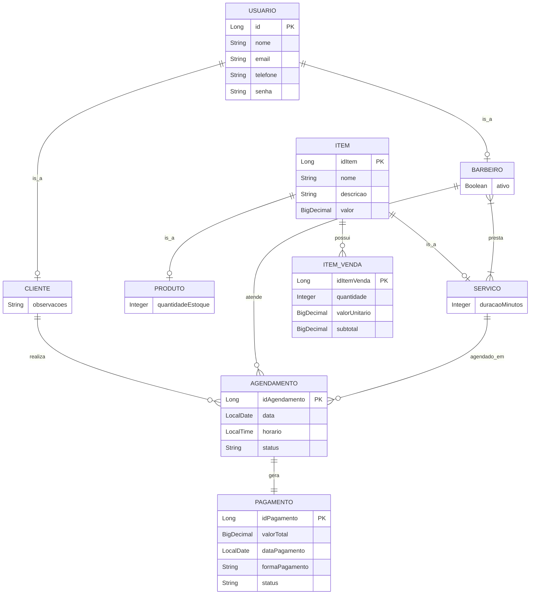

# 💈 API de Gerenciamento para Barbearias (Barbearia API)

**Instituição:** Instituto Federal Goiano — Campus Urutaí (IFG)  
**Disciplina:** Programação Web Ⅱ  
**Objetivo:** Desenvolvimento de uma API RESTful para automatizar e centralizar as operações de uma barbearia ou salão de beleza.

---

## 👥 Desenvolvedores e Atribuições

- **Renan Nunes de Souza** — *Usuário, cliente, Barbeiro e criação do Agendamento Teste.*
- **Daniel Francisco de Maria da Fonseca Rincon** — *Pagamento e Agendamento.*
- **Ryan Victor Carvalho de Oliveira** — *Produto , Serviço e itemVenda.*

---

## 📖 Contexto e Motivação

O controle operacional de uma barbearia envolve conciliar a agenda de profissionais, registrar o histórico de clientes, gerenciar o estoque de produtos e processar pagamentos. Quando realizado de forma analógica (agenda de papel) ou fragmentada (WhatsApp e planilhas separadas), esse processo gera conflitos de horários, perda de dados e furos no caixa.

A **Barbearia API** nasce para solucionar essa dor. Trata-se de um sistema back-end que unifica essas regras de negócio, oferecendo rotas seguras para que aplicações front-end (web ou mobile) possam consumir os dados, agendar cortes sem risco de sobreposição e fechar vendas de maneira automatizada.

---

## 🚀 Tecnologias Utilizadas

A aplicação foi construída com ferramentas modernas do ecossistema Java, visando alta performance e fácil manutenção:
- **Linguagem:** Java 21
- **Framework Principal:** Spring Boot 3.4.6
- **Persistência de Dados:** Spring Data JPA + Banco MySQL (Estratégia de herança `JOINED`)
- **Mapeamento DTO:** MapStruct 1.6.3
- **Cache de Consultas:** Spring Cache (`@Cacheable` e `@CacheEvict`)
- **Maturidade REST:** Spring HATEOAS (Inclusão de links de navegabilidade)
- **Documentação Interativa:** Springdoc OpenAPI 3 (Swagger)
- **Testes:** JUnit 5 + Mockito

---

## ⚙️ Escopo Funcional

As principais funcionalidades entregues pela API incluem:

| Categoria | Descrição do Requisito Funcional |
| :--- | :--- |
| **Usuários** | Cadastro segregado entre `Clientes` e `Barbeiros`, compartilhando atributos comuns de acesso. |
| **Catálogo** | Cadastro de `Serviços` (medidos por tempo de duração) e `Produtos` (medidos por quantidade em estoque). |
| **Agendamentos** | Criação de reservas vinculando o Cliente, o Barbeiro e o Serviço escolhido em datas específicas. |
| **Validação** | Bloqueio automático de agendamentos caso o Barbeiro solicitado já possua um cliente no mesmo dia e horário. |
| **Financeiro** | Processamento de Pagamentos. Ao confirmar um pagamento, o agendamento respectivo muda para o status `CONCLUIDO`. |
| **Segurança** | Bloqueio de pagamentos para serviços que estejam com o status `CANCELADO`. |

### 🛠️ Requisitos Não Funcionais Aplicados
- **Arquitetura em Camadas:** Divisão estrita entre `Controllers` (rotas), `Services` (regras de negócio), `Repositories` (banco) e `Models` (entidades).
- **Value Objects (VO):** Uso de VOs embutidos para garantir que e-mails, telefones e senhas sejam sempre válidos (sem strings soltas pelo código).
- **HATEOAS:** O sistema guia o cliente da API fornecendo hiperlinks (`_links`) para as próximas ações possíveis, alcançando o Nível 3 de Maturidade de Richardson.

---

## 📊 Modelagem do Sistema

### Diagrama de Classes
Abaixo, a estrutura de classes, destacando as heranças e os *Value Objects* utilizados:




### Diagrama Entidade-Relacionamento (DER)
A modelagem do banco de dados relacional gerada pelo sistema:




---

## 💡 Destaques Arquiteturais da Implementação

1. **Estratégia de Herança `@Inheritance(strategy = InheritanceType.JOINED)`:**
   Em vez de criar tabelas duplicadas ou uma tabela gigante com colunas vazias, o sistema utiliza o polimorfismo do banco de dados. Temos uma tabela central de `usuarios` e tabelas filhas `clientes` e `barbeiros`. O mesmo conceito foi aplicado para a tabela `itens`, que se divide em `produtos` e `servicos`.

2. **Gerenciamento de Agendamentos (Tratamento de Exceções):**
   A validação de horários foi encapsulada no `AgendamentoService`. Se um cliente tentar marcar um horário ocupado, o sistema dispara uma `AgendamentoInvalidoException`. Essa exceção é capturada globalmente por um `@ControllerAdvice`, que formata um erro HTTP 400 amigável para o front-end.

3. **Performance com Spring Cache:**
   Endpoints de alta requisição, como listagem de catálogo e de profissionais, foram cacheados com `@Cacheable`. Qualquer mutação no banco (`POST`, `PUT`, `DELETE`) dispara um `@CacheEvict` para atualizar a memória instantaneamente.

---

## 💻 Instruções para Execução Local

Siga os passos abaixo para rodar a aplicação em seu ambiente de desenvolvimento:

1. **Clone o repositório:**
   ```bash
   git clone [https://github.com/seu-usuario/barbearia-api.git](https://github.com/seu-usuario/barbearia-api.git)
   cd barbearia-api

   ### 📡 Exemplo de Consumo da API (Agendamento)

Abaixo, um exemplo prático de como consumir o endpoint de criação de agendamentos (`POST /agendamentos`), demonstrando o uso de DTOs de entrada e o retorno HATEOAS.

**Requisição (JSON):**
```json
POST /agendamentos
Content-Type: application/json

{
  "data": "2026-06-15",
  "horario": "14:30:00",
  "idCliente": 1,
  "idBarbeiro": 2,
  "idServico": 1
}

## Resposta de Sucesso (201 Created):
O sistema valida o conflito de horários e, em caso de sucesso, retorna o objeto persistido com os links de navegabilidade (HATEOAS):

{
  "idAgendamento": 1,
  "data": "2026-06-15",
  "horario": "14:30:00",
  "status": "AGENDADO",
  "nomeCliente": "João Silva",
  "nomeBarbeiro": "Marcos",
  "nomeServico": "Corte Degradê",
  "_links": {
    "self": {
      "href": "http://localhost:8080/agendamentos/1"
    },
    "agendamentos": {
      "href": "http://localhost:8080/agendamentos"
    }
  }
}
